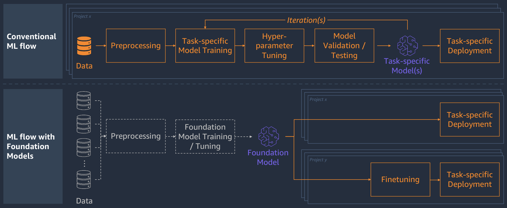

# AI/ML and Generative AI
## Introduction

In today's fast-paced, data-driven world, the fusion of Machine Learning (ML) and Artificial Intelligence (AI) has become a game-changer across diverse sectors. But within this realm of technological innovation, lies an even more disruptive technology - Generative AI.

AI and ML have already proven their worth in optimising processes, predicting outcomes and automating tasks. However, Generative AI takes this a step further by not just understanding patterns but creating new content, solutions, and possibilities.

The synergy between AI/ML and Generative AI isn't confined to technology labs or niche applications; it's a powerhouse that resonates across every sector. Whether it's healthcare, finance, entertainment, or manufacturing, this collaboration fuels innovation and unlocks business value in ways previously unimaginable.

From revolutionising drug discovery in pharmaceuticals to enhancing customer experiences through personalised content, the application of Generative AI coupled with AI/ML has transformed industries' operational landscapes. It's not just about efficiency; it's about fostering innovation, creativity, and delivering unparalleled value.

## What's All The Hype About?

Generative AI refers to a class of machine learning models that can generate new, original and coherent content based on a dataset. These models can be used for a variety of tasks, such as generating text, images, music, and even code. Some of the most popular types of generative AI models include [Generative Adversarial Networks](https://machinelearningmastery.com/what-are-generative-adversarial-networks-gans/) (GANs) and [Variational Autoencoders](https://towardsdatascience.com/understanding-variational-autoencoders-vaes-f70510919f73) (VAEs).

The hype around generative AI stems from its potential applications in various fields, such as image and video generation, natural language processing, and game design. It is also being used in practical applications such as image-to-image translation, data augmentation, and semi-supervised learning. Additionally, generative AI has caught the attention of artists and creatives, who have found interesting ways to use it in their work.

However, as with all AI technologies, there are also concerns about its potential misuse, such as for deepfakes and fake news. Additionally, the training of generative AI models requires large amounts of data, and this can lead to ethical concerns about data privacy and the use of biased or unethical datasets.

## AI vs ML

AI and ML are related but distinct concepts. AI is the broader field that encompasses the goal of creating intelligent systems that can perform tasks that require human-like intelligence, such as understanding speech, recognising objects, and making predictions. ML is a subset of AI that focuses on teaching computers to learn and improve from data without being explicitly programmed.

In terms of AWS, Azure, and Google Cloud services, all three cloud providers offer a range of AI and ML services, including natural language processing, computer vision, and predictive analytics. These services enable developers to build intelligent applications without having to build the underlying AI and ML algorithms themselves.

In terms of positioning AI and ML in a multi-cloud architecture, the best approach will depend on the specific use case and the requirements. However, in general, most AI and ML services can be easily integrated into a multi-cloud architecture, as they can be accessed via APIs or SDKs, and data can be stored in cloud storage services like Amazon S3, Azure Blob Storage, or Google Cloud Storage. This allows organisations to take advantage of the best services from different cloud providers to suit their specific needs.

Examples of where Generative AI can be used:

* Text generation
* Chatbot/Virtual Assistant
* Text extraction and summarisation
* Search
* Code generation
* Image generation
* Image classification
* Music creation
* Video creation

## Foundational Models

A conventional machine learning flow typically involves a sequential process of data pre-processing, feature engineering, model training, validation, and deployment. Let's delve into each stage to gain a better understanding of how machine learning works:

1. First, we have a load of data - this could be images, text, numbers, etc. Whatever it is, it's the data that our machine learning model will be working with.
2. Next, we split this data into a few parts. One part is called the training data, and this part is used to train the model. Another part is called the testing data, and this part is used to see how well the model does at making predictions.
3. Now, it's time to train the model. The training data is fed into the model, and the model uses this data to learn patterns and relationships. This can be time consuming, depending on how complex the model is and the amount of data it has to work with.
4. Once the model has been trained, it's time to test it. The testing data is then fed into the model, and the model makes predictions based on the patterns and relationships it has learned.
5. Finally, we evaluate the performance of the model. We look at how well it was able to predict the testing data, and we compare its performance to the performance of other models. If the performance is good, we can use the model to make predictions on new data.

So, that's a basic overview of the conventional machine learning flow. It's a process that can take a lot of time and computational power, but in the end, it can help us understand and work with complex data and make predictions based on that data.

*Source: Amazon Web Services*

Generative AI foundation models are a type of deep learning model that can be used to generate new data or information from existing data. They are designed to mimic the behavior of the human brain and can learn to represent and model complex data distributions.

One of the main applications of generative AI foundation models is in the field of natural language processing (NLP), where they can be used to generate text, such as news articles or social media posts, from a given prompt or seed text. They are also used in computer vision tasks, such as image generation, and in audio processing, where they can be used to generate new music or speech.

Generative AI foundation models are based on the concept of "autoencoders," which are neural networks that are designed to learn to compress and reconstruct data. Autoencoders can be thought of as a type of unsupervised learning, where the model learns to represent the data in a compact and efficient way without being provided with any explicit labels or annotations.

Generative AI foundation models differ from traditional autoencoders in that they not only learn to represent the data, but also to generate new data that is consistent with the learned representation. This makes them particularly useful for tasks such as data augmentation, where they can be used to increase the number of samples in a dataset, and for generating new data that can be used in training other deep learning models.

## Large Language Models (LLMs)

AWS offers a number of large language models (LLMs) through its platform. These models are designed for natural language processing (NLP) tasks such as text generation, translation, and information extraction. AWS offers a suite of generative AI services, including Amazon Rekognition Custom Labels, Amazon Textract Custom Forms, and Amazon SageMaker Ground Truth. AWS's generative AI services are used by customers such as Toyota, Unilever, and NASA.

Some of the LLMs available include:

* BERT (Bidirectional Encoder Representations from Transformers): A deep learning model that processes text in order to generate corresponding vectors. These vectors can then be used for tasks such as language translation, text classification, and named entity recognition.
* RoBERTa (Robustly Optimised BERT Pretraining): A version of BERT that is pre-trained on a larger dataset and designed to be more robust to variations in input text.
* XLM-R (Cross-lingual Language Model): A multilingual version of BERT that is designed to learn multiple languages simultaneously.
* ALBERT (A Lite BERT): A version of BERT that is more efficient in terms of memory and computation, making it suitable for resource-constrained environments.
* T5 (Text-To-Text Transfer Transformer): A large-scale transformer-based NLP model that is pre-trained on a dataset of text-to-text pairs and can be used to perform various text generation tasks.

These LLMs can be accessed through various AWS services, such as Amazon Comprehend, Amazon Translate, and Amazon Lex. These services allow users to easily integrate these LLMs into their applications to perform a wide range of NLP tasks.

Large language models (LLMs), such as BERT and GPT-4, can be used in various ways on Microsoft Azure. One common use is for natural language processing (NLP) tasks such as text classification, named entity recognition, and sentiment analysis. LLMs can also be used for natural language understanding (NLU) tasks such as answering questions and generating text.

Azure offers a variety of services and tools for working with LLMs, including Azure Cognitive Services, Azure Machine Learning, and Azure Text Analytics. These services can be used to train and deploy LLMs, as well as to use the models provided by Azure for NLP and NLU tasks.

Additionally, Azure provides a variety of tools and frameworks for building and deploying LLMs, such as the Azure Machine Learning Python SDK and the Azure Machine Learning Experimentation SDK. These tools can be used to develop, train, and deploy LLMs on Azure, as well as to use the models provided by Azure for NLP and NLU tasks.

Google Cloud provides a variety of tools and services that enable developers to access and utilise these language models, including:

* Cloud Natural Language API: A service that uses machine learning techniques to extract insights and information from text. It provides access to pre-trained models such as BERT and ELECTRA, which can be used for tasks such as sentiment analysis, entity recognition, and text classification.
* Cloud Translation API: A service that uses machine learning techniques to translate text from one language to another. It provides access to pre-trained models such as BERT and mBART, which can be used for tasks such as sentence-level translation and language detection.
* Cloud Text-to-Speech API: A service that uses machine learning techniques to convert text into synthesised speech. It provides access to pre-trained models such as WaveRNN and Tacotron, which can be used for tasks such as text-to-speech synthesis and voice cloning.
* Cloud AutoML Natural Language: A service that allows developers to train and deploy custom NLP models using Google Cloud's managed infrastructure. It provides access to pre-trained models such as BERT and ELECTRA, which can be used for tasks such as named entity recognition, sentiment analysis, and text classification.

Google Cloud offers generative AI services, including Cloud AutoML Vision, Cloud AutoML Natural Language, and Cloud Speech-to-Text. GCP's generative AI services are used by customers such as Google, Spotify, and PayPal.

Overall, all three cloud providers offer similar generative AI services, and the best collection of services will depend on the specific use case and requirements of each customer.

## Getting Started

There are several ways to get started with generative AI within your organisation, but here are some general steps you can follow:

1. **Define your goals:** What do you want to accomplish with generative AI? This will help you choose the right approach and tools.
2. **Research:** Read up on the latest research and trends in the field of generative AI, and familiarise yourself with specific tools and techniques that might be useful for your business.
3. **Experiment:** Try experimenting with different tools and techniques to see what works best for your specific needs. This can involve trying out different algorithms, data sets, and architectures.
4. **Evaluate:** Once you have experimented with different approaches, evaluate their effectiveness and feasibility for your business goals. This may involve measuring performance and comparing results to those achieved with other approaches.
5. **Implement:** Once you have chosen the best approach for your business, implement it in a production environment. This can involve building custom software or using existing tools and platforms.
6. **Monitor:** After implementing generative AI, continue to monitor its performance and make adjustments as needed. This can involve measuring key performance indicators (KPIs) and making changes to the AI model or infrastructure.

## Further Reading

**[Generative AI on Amazon Sagemaker](https://pages.awscloud.com/rs/112-TZM-766/images/AWS_GenAI_on_Amazon_SageMaker.pdf)** - Learn more about Generative AI on AWS and find out about services such as Amazon CodeWhisperer and Amazon Sagemaker Jump Start

**[Competing in the Age of AI: Strategy and Leadership When Algorithms and Networks Run the World](https://amzn.to/3FWJ4oD)** - Marco Iansiti and Karim R. Lakhani show how reinventing the firm around data, analytics, and AI removes traditional constraints on scale, scope, and learning that have constrained business growth for hundreds of years.

**[Generative AI services on AWS](https://aws.amazon.com/generative-ai/technology/)** - AWS Generative AI Services

**[Generative AI services on Azure](https://azure.microsoft.com/en-us/solutions/ai)** - Azure Generative AI Services

**[Generative AI services on Google Cloud](https://cloud.google.com/ai/generative-ai)** - Google Cloud Generative AI Services
