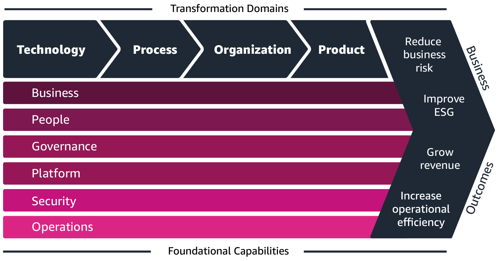
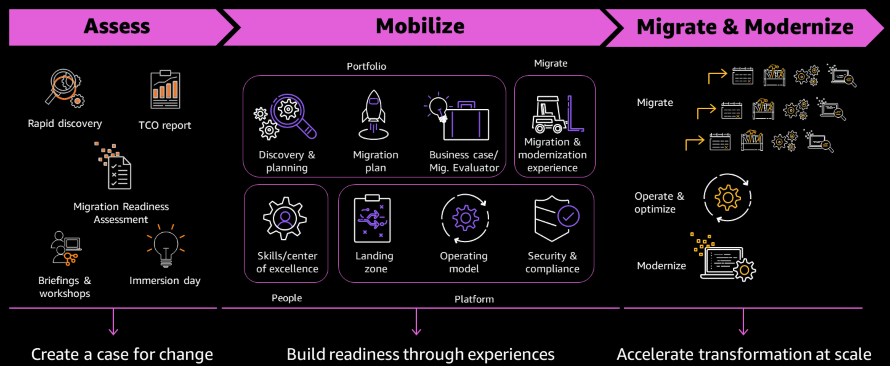
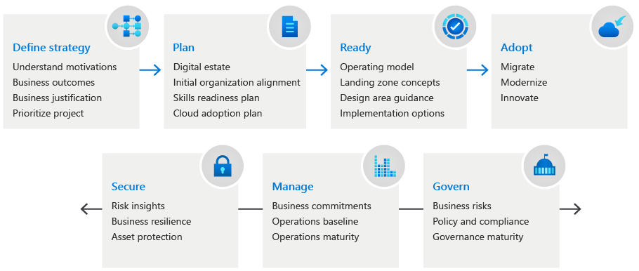
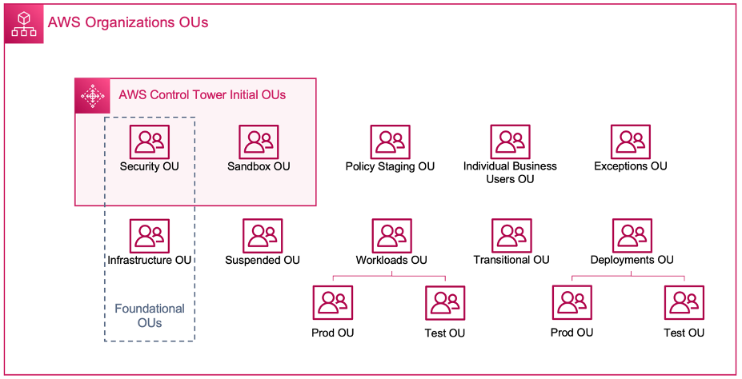
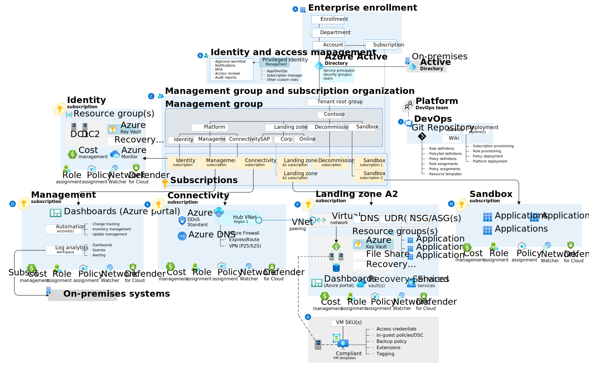
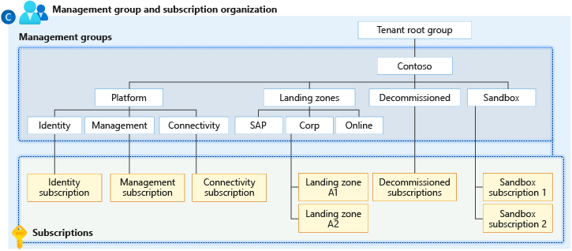
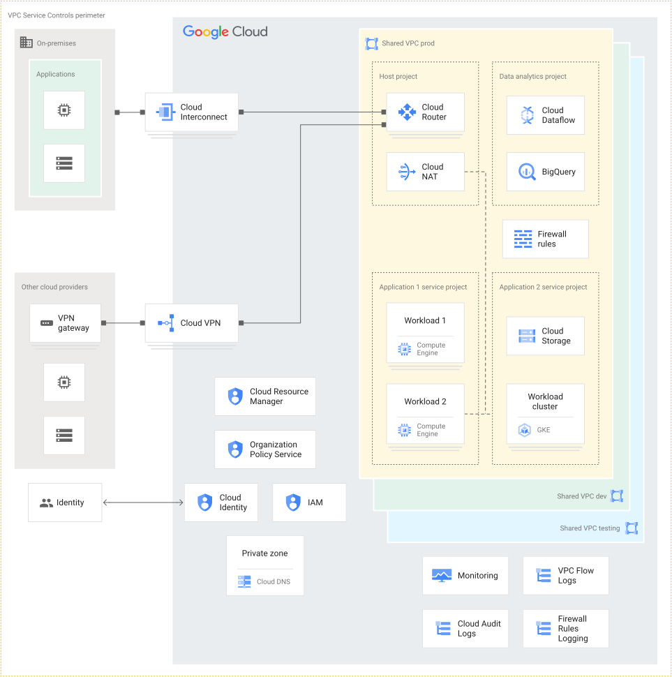

# Cloud Adoption and Landing Zones

## Introduction

A Landing Zone (LZ) forms the foundation of your cloud platform and centrally provides networking, account vending, security, logging and guardrail capabilities for all accounts within your organisation. Without an LZ deployed, there will be an administrative overhead for your cloud and technology teams as they will likely need to configure the settings and access in each individual account which is created.

AWS, Microsoft Azure and Google Cloud each have their own design for an LZ on their platforms, but importantly they all have the deployment of this capability as part of their Cloud Adoption Framework (CAF).

## Cloud Adoption

Jump to: [Microsoft Azure](./README.md#microsoft-azure) [Google Cloud](./README.md#google-cloud)

### Amazon Web Services

> The AWS Cloud Adoption Framework (AWS CAF) leverages AWS experience and best practices to help you digitally transform and accelerate your business outcomes through innovative use of AWS. AWS CAF identifies specific organisational capabilities that underpin successful cloud transformations. These capabilities provide best practice guidance that helps you improve your cloud readiness.
> 
> AWS CAF groups its capabilities in six perspectives: Business, People, Governance, Platform, Security, and Operations. Each perspective comprises a set of capabilities that functionally related stakeholders own or manage in the cloud transformation journey. Use the AWS CAF to identify and prioritise transformation opportunities, evaluate and improve your cloud readiness, and iteratively evolve your transformation roadmap.

The AWS CAF provides a clear roadmap for cloud adoption within your organisation and places a heavy focus on the need to adapt your culture to take full advantage of the cloud. The need to adapt processes and invest in training cannot be understated to ensure that you build the right teams from external hires or internal up-skilling who are set up for success. They need to technically deliver your migration and operational capability, but also promote ways of working and help teams who may have only worked with on-premises servers for the last 15 or more years. Cloud Adoption should not simply be about hiring a load of new team members who lack the historical context of the organisation as this will introduce an 'us and them' culture. Instead this needs to be a fine balance between adapting existing roles, hiring new talent and leveraging partner support for acceleration and tiger-teaming.

The AWS Cloud Migration Journey has three different phases:

* **Assess** - The first phase of a cloud migration begins with a cloud readiness assessment of your enterprise’s current state. These assessment tasks give you a clear picture of what you will migrate, as well as a business case for migration and total cost of ownership (TCO) analysis for migration.
* **Mobilise** - With a strong understanding of your current state and your portfolio along with the solid business case, you develop in the assessment phase, you can demonstrate the value of the cloud to your organisation.
* **Migrate and Modernise** - The migrate phase uses the patterns, processes, tools, resources, and methodology defined and tested during the mobilise phase to migrate applications at scale. After using the best practices and lessons learned from the earlier phases, you can implement a migration factory, a blueprint of scaling implementation and operations, through automation and agile delivery.

During the Assess phase, there will be an analysis conducted of the servers and services which are currently deployed in your on-premises environment to help build the executive business case for migrating to the cloud. This assessment will also look at your ways of working and processes such as "do you already use DevSecOps within your organisation" or "what's your approach to training and development" to understand how your internal teams will address the need to up-skill. To get a better understanding of your cloud readiness, you can take this intuative assessment which will score your answers against a cloud adoption baseline then provide recommendations on areas for focus and improvement: https://cloudreadiness.amazonaws.com/#/cart

The Mobilise will focus on the people, platform, portfolio and migrate elements of the migration journey. For the people perspective, an upskilling capability will be introduced into the business to provide virtual or instructor-delivered training to key teams in response to the skills gap assessment carried out during Assess. The new landing zone and operating model will be designed to meet the compliance and operational needs of the business. This essentially establishes the key foundations for the migration prior to the next phase where a 'migration factory' approach is taken to migrate your applications efficiently and effectively.

Migrate and Modernise is the final phase where you now accelerate your transformation. You have teams trained to start supporting applications in the cloud, your landing zone is deployed and configured to meet all of your organisation's security and compliance needs, and the business case for migration has been approved and ratified for each application that is in-scope. This will also be the phase where certain applications are decommissioned (sunsetted) and replaced with new capabiilties born in the cloud.

You can download a full copy of the AWS Cloud Adoption Framework via the link in the [Further Reading](./README.md#further-reading) section below.

### Microsoft Azure

> The Microsoft Cloud Adoption Framework for Azure guides you through each consideration and implementation along the phases of your cloud adoption journey. Use the Cloud Adoption Framework across your organization to prepare decision makers, central IT, and the cloud center of excellence (CCoE) for your organization's cloud adoption efforts.

Microsoft has developed their Cloud Adoption Strategy Evaluator to help you ascertain which areas of your current processes and ways of working require focus to take the best advantage of the cloud: https://learn.microsoft.com/en-us/assessments/8fefc6d5-97ac-42b3-8e97-d82701e55bab/. 

The Azure Cloud Adoption Journey has four different phases:

* **Strategy** - To take advantage of this great potential, start by documenting your business strategy in a way that's both understandable to cloud technicians and palatable to your business stakeholders.
* **Plan** - Convert the aspirational goals of a cloud adoption strategy into an actionable plan. Your collective cloud teams can use the cloud adoption plan to guide their technical efforts and align them with your organization's business strategy.
* **Ready** - Before adoption can begin, you create a landing zone to host the workloads that you plan to build in or migrate to the cloud.
* **Adopt** - The Adopt methodology shows you how to migrate, modernize, innovate, and relocate workloads in Azure.

### Google Cloud

## Landing Zones

### AWS Landing Zone

A landing zone is a well-architected, multi-account AWS environment that is scalable and secure. This is a starting point from which your organisation can quickly launch and deploy workloads and applications with confidence in your security and infrastructure environment. Building a landing zone involves technical and business decisions to be made across account structure, networking, security, and access management in accordance with your organisation’s growth and business goals for the future.

When you start to use AWS at scale, you can look to AWS for prescriptive guidance and an approach for establishing your environment. AWS best practices in this area centre around the need to isolate resources and workloads into multiple AWS accounts (resource containers) for isolation and scope of impact reductions.

AWS Accounts should be seen as security constructs for each workload and environment. Approaching it in this way allows you to provide a clear boundary for which you can grant users and services access to deploy and manage services. When multiple applications and environments are deployed into a single account, you can run the risk of 'horizontal travel' from threats. This of course doesn't mean that threats cannot traverse the account boundary, however, it's the best practice approach for structuring your organisations cloud footprint.

An organisation's account structure is determined by AWS Organisations, allowing you to create security containers into which policies can be applied. These organisational units (OUs) can represent the functional layout of your business units, or your product categories as two examples. Generally you would also have OUs for your environments as OUs under the parent containers in additionl to the default containers for security and auditing.

When deploying a Landing Zone on AWS, you essentially have two options; a custom deployment or AWS Control Tower. AWS Control Tower provides an out-of-the-box experience by deploying the key foundational services required for your environment in accordance with the [AWS Prescriptive Guidance](https://docs.aws.amazon.com/prescriptive-guidance/latest/migration-aws-environment/building-landing-zones.html). This will include services such as centralised logging, SSO federation with your central identity provider (IdP) such as Microsoft Entra or on-premises Active Directory, security auditing and cross-account roles. Should you already be using AWS Organisations in your environment, but wish to transition over to AWS Control Tower, then there is a supported migration path which you can read more about here: https://aws.amazon.com/blogs/mt/migrate-aws-landing-zone-solution-to-aws-control-tower/.

Customising your account guardrails and configurations can be done in a variety of ways:

**Manually** - Each account can have its networking components (VPCs etc) deployed on a case-by-case basis on top of the standard guardrails which are deployed. Whilst this allow the account vending process to be swift, it does make any standard deployments really difficult to manage, and I would suggest that this approach does not scale well at all. Some customers may also overlay Terraform on top of this approach and try to manage this standardisation from each project, however, it would be likely that new approaches would not be retro-fitted to existing accounts and technical debt would be built up.

A lightweight landing zone deployment (LZ-Lite) would fit well in this category where you need to provide centralised guardrails but for a proof-of-concept (PoC) project which will only require a small number of accounts. This would still require the deployment of AWS Control Tower and AWS Organisations, however, would not require some of the mechanisms in the more robust solutions for deploying accounts and configurations at scale. This route would not prevent the migration of the workload accounts to a larger landing zone deployment at a future point.

**Customisations for Control Tower (CfCT)** - This is an add-on for AWS Control Tower providing the ability to deploy customisations from your central shared services account which are deployed out to consumer accounts using automation and pipelines. If your cloud team does not have a robust handle on Terraform or is more comfortable with CloudFormation then this is a very suitable solution.

**Git Repository:** https://github.com/aws-solutions/aws-control-tower-customizations

**Documentation:** https://docs.aws.amazon.com/controltower/latest/userguide/cfct-overview.html

**AWS Control Tower Account Factory for Terraform (AFT)** - This is an add-on for AWS Control Tower which allows your entire account configuration to be managed and controlled using automation and Terraform. This is especially recommended if you have a cloud operations team who are familiar with DevSecOps and managing Terraform, and you are deploying this environment from scratch. There are also advanced approaches which you can use to migrate to AFT, however this isn't going to be covered here.

**Git Repository:** https://github.com/aws-ia/terraform-aws-control_tower_account_factory

**Documentation:** https://docs.aws.amazon.com/controltower/latest/userguide/aft-overview.html

Aside from your core account vending and auditing capabilities, there are other services which would be deployed centrally which would provide core networking, reporting, service catalog and security capabilities which would be consumed by each workload account. Take a look through this list of services which you should be familiar with when determining which capabilities to deploy for your environment.

|Service Name|Category|Capability|
|---|---|---|
|**[AWS Security Hub](https://aws.amazon.com/security-hub)**|Security, Identity and Compliance|AWS Security Hub is a cloud security posture management (CSPM) service that performs security best practice checks, aggregates alerts, and enables automated remediation. You can deploy AWS Security Hub into your organisation to baseline each account against industry standard benchmarks such as NIST, CIS, HIPPA and more. AWS Security Hub can then use mechanisms such as [Automated Security Response](https://aws.amazon.com/solutions/implementations/automated-security-response-on-aws/) to automatically remediate findings.|
|**[Amazon Detective](https://aws.amazon.com/detective)**|Security, Identity and Compliance|Amazon Detective simplifies the investigative process and helps security teams conduct faster and more effective investigations. With the Amazon Detective prebuilt data aggregations, summaries, and context, you can quickly analyse and determine the nature and extent of possible security issues.|
|**[Amazon GuardDuty](https://aws.amazon.com/guardduty)**|Security, Identity and Compliance|Amazon GuardDuty is a threat detection service that continuously monitors your AWS accounts and workloads for malicious activity and delivers detailed security findings for visibility and remediation.|
|**[Amazon Inspector](https://aws.amazon.com/inspector)**|Security, Identity and Compliance|Amazon Inspector is an automated vulnerability management service that continually scans AWS workloads for software vulnerabilities and unintended network exposure.|
|**[Amazon Route 53](https://aws.amazon.com/route53)**|Networking and Content Delivery|Amazon Route 53 is a highly available and scalable Domain Name System (DNS) web service. Route 53 connects user requests to internet applications running on AWS or on-premises. Centralise your public and private zone management, using service roles and resource sharing to delegate zone management to workload accounts|
|**[AWS Transit Gateway](https://aws.amazon.com/transit-gateway)**|Networking and Content Delivery|AWS Transit Gateway connects your Amazon Virtual Private Clouds (VPCs) and on-premises networks through a central hub. This connection simplifies your network and puts an end to complex peering relationships. Transit Gateway acts as a highly scalable cloud router—each new connection is made only once.|
|**[Cloud Financial Management](https://aws.amazon.com/aws-cost-management)**|Billing|Whilst this is not a dedicated service, but a collection of different services, it's important to highlight that deploying an LZ using one of the patterns above will give you access to centralised billing management where you can analyse costs and share reserved instances across your organisation.|
|**[IPAM, part of AWS VPC](https://aws.amazon.com/vpc/features/)**|Networking and Content Delivery|IPAM makes it easier for you to plan, track, and monitor IP addresses for your AWS workloads. IPAM automates IP address assignments to your Amazon VPC, removing the need to use homegrown or spreadsheet-based planning applications. It also enhances your network observability by showing IP usage across multiple accounts and VPCs in a unified operational view.|
|**[AWS Systems Manager](https://aws.amazon.com/systems-manager)**|Management and Governance|AWS Systems Manager is a secure end-to-end management solution for resources on AWS and in multicloud and hybrid environments. AWS Systems Manager centralises many of your cloud ops capabilities such as patching, remote administration, application management, change management, operations and monitoring.|
|**[AWS Service Catalog](https://aws.amazon.com/servicecatalog)**|Management and Governance|AWS Service Catalog lets you centrally manage your cloud resources to achieve governance at scale of your infrastructure as code (IaC) templates, written in CloudFormation or Terraform configurations. With AWS Service Catalog, you can meet your compliance requirements while making sure your customers can quickly deploy the cloud resources they need.|

### Azure Landing Zone

An Azure landing zone is an environment that follows key design principles across eight design areas. These design principles accommodate all application portfolios and enable application migration, modernization, and innovation at scale. An Azure landing zone uses subscriptions to isolate and scale application resources and platform resources. Subscriptions for application resources are called application landing zones, and subscriptions for platform resources are called platform landing zones.

An Azure landing zone architecture is scalable and modular to meet various deployment needs. A repeatable infrastructure allows you to apply configurations and controls to every subscription consistently. Modules make it easy to deploy and modify specific Azure landing zone architecture components as your requirements evolve.

Management groups provide a governance scope above subscriptions. You organise subscriptions into management groups; the governance conditions you apply cascade by inheritance to all associated subscriptions. Management groups give you enterprise-grade management at scale, no matter what type of subscriptions you might have. You can build a flexible structure of management groups and subscriptions to organize your resources into a hierarchy for unified policy and access management.

[Azure Policy](https://learn.microsoft.com/en-us/azure/governance/policy/overview) is used for centralising the guardrails within your landing zone and can be used for enforcing how resources are used and also the taxonomy (tags) which have to be configured. Resources which are in a non-compliant state can be remediated to the desired state depending on the policy which is breached. 

Microsoft Defender for Cloud is the centralised tool which allows you to apply best practice security benchmarks to your subscriptions, then to report on required remediations. Baselines available include CIS, NIST and the Microsoft Cloud Security Benchmark (MCSB). The MCSB provides prescriptive best practices and recommendations to help improve the security of workloads, data, and services on Azure and your multi-cloud environment. Security is at the core of the Azure landing zone accelerator and as part of the implementation, many tools and controls are deployed to help organisations quickly achieve a security baseline.

|Service Name|Category|Capability|
|---|---|---|
|**[Microsoft Defender for Cloud](https://learn.microsoft.com/en-us/azure/defender-for-cloud/defender-for-cloud-introduction)**|Security and Compliance|Microsoft Defender for Cloud is a cloud-native application protection platform (CNAPP) with a set of security measures and practices designed to protect cloud-based applications from various cyber threats and vulnerabilities.|
|**[Microsoft Sentinel](https://learn.microsoft.com/en-us/azure/sentinel/overview)**|Log Aggregation|Microsoft Sentinel is a scalable, cloud-native solution providing Security information and event management (SIEM) and Security orchestration, automation, and response (SOAR) capabilities. Microsoft Sentinel is your bird's-eye view across the enterprise alleviating the stress of increasingly sophisticated attacks, increasing volumes of alerts, and long resolution time frames. Microsoft Sentinel natively incorporates proven Azure services, like Log Analytics and Logic Apps. Microsoft Sentinel enriches your investigation and detection with AI. It provides Microsoft's threat intelligence stream and enables you to bring your own threat intelligence.|
|**[Azure DDoS Protection](https://learn.microsoft.com/en-us/azure/ddos-protection/ddos-protection-overview)**|Networking and Content Delivery|Azure DDoS Protection, combined with application design best practices, provides enhanced DDoS mitigation features to defend against DDoS attacks. It's automatically tuned to help protect your specific Azure resources in a virtual network. Protection is simple to enable on any new or existing virtual network, and it requires no application or resource changes.|

### Google Cloud Landing Zone

Landing zones help your enterprise deploy, use, and scale Google Cloud services more securely. Landing zones are dynamic and grow as your enterprise adopts more cloud-based workloads over time. A landing zone spans multiple areas and includes different elements, such as identities, resource management, security, and networking.

## Further Reading

#### [Reaching Cloud Velocity: A Leader's Guide to Success in the AWS Cloud](https://amzn.to/3QqW36D)

Reaching Cloud Velocity provides leadership best practices covering the most requested customer topics. Whilst there is a heavy focus on services which are provided on the AWS Cloud, there are cloud agnostic approaches that are shared in this book which can be applied to any cloud platform.

* How enterprises are transforming with AWS
* Aligning business and technology strategy to benefit from cloud
* Re-skilling and scaling your cloud fluency
* Setting the right culture and organization model to attract and retain engineering talent
* How to migrate data centres to AWS while holistically benefiting from the improved availability, security, and governance it can offer.

The book also goes deeper into how leaders can leverage the inherent reliability and durability of the AWS Cloud, and how compute, containers, serverless, APIs, microservices, database, analytics, and machine learning have evolved into a set of highly resilient, secure, and scalable building blocks - allowing builders to innovate at a fraction of the costs they would have typically come to expect.

#### [AWS Cloud Adoption Framework](https://aws.amazon.com/cloud-adoption-framework/)
Access the latest copy of the AWS CAF here and download the full eBook copy to understand each element of a cloud adoption journey.
