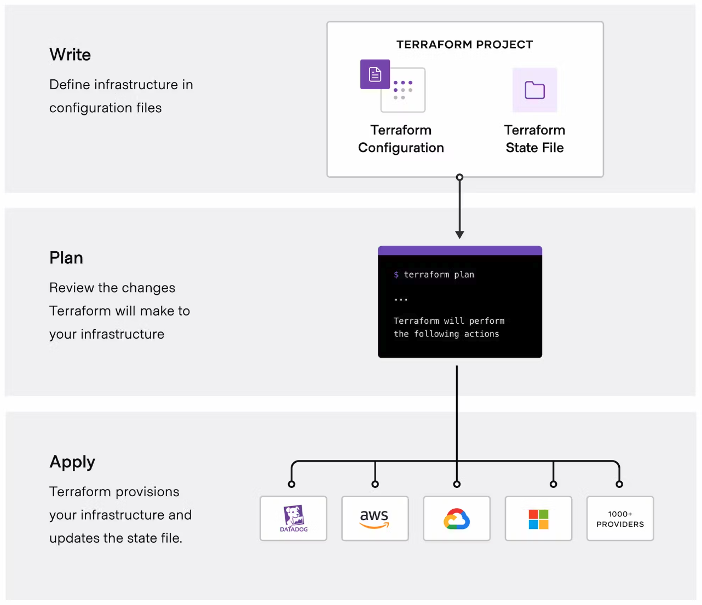
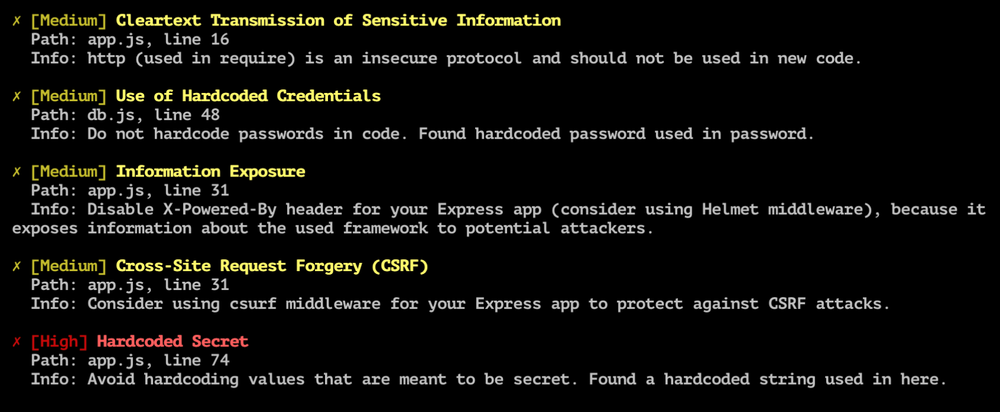
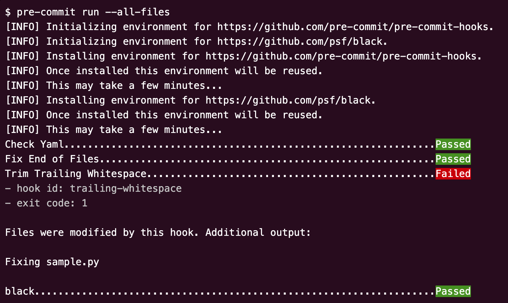
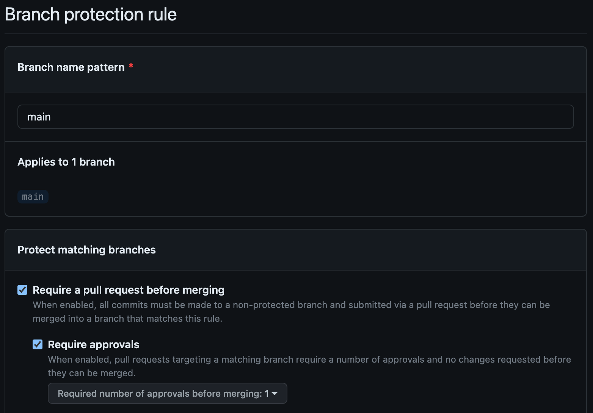
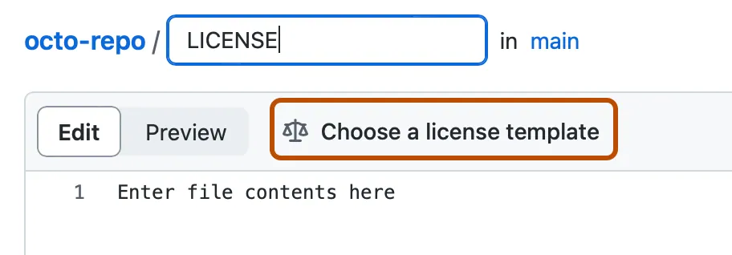

# DevSecOps

## Introduction

DevSecOps is a common framework which describes the mechanisms which developers use to develop, secure and deploy their code. This is particularly popular within the cloud space as it allows developers to work at pace, whilst allowing information security teams to assure the pipeline tasks to automatically catch poor code quality and vulnerabilities such as credentials in repositories.

Tools in this space are *constantly* changing, so please don't take this as an exhaustive list. If you have experience of working with a specific tool, [submit a feature request](https://github.com/ascoarchitect/multi-cloud-architecture/issues/new) with all the details to get them added here for all to learn.

## Terraform

I'm going to include a specific section on Terraform here, because I can't emphasis enough the need to become familiar with its approach and application. I doubt many if any cloud engineers or cloud developers will not come across Terraform at some point, so here's a basic breakdown of some of the elements.

There are three phases to developing Terraform, including writing the configuration files, planning your deployment then applying your code.



The plan phase allows you to see the changes that your code will make to an environment before it is applied, therefore you can quickly spot any issues before they become irreversible. When it comes to 'applying' your changes using terraform apply, I have come across developers who skip the plan phase and just run ```terraform apply -auto-approve``` which just deploys the code without any checks or warning. Now, whilst there are cases where -auto-approve is used, such as in a pipeline task for automated deployment, these are always preceded with a plan phase where validation can be carried out. We're all human and prone to mistakes - see it as an advantage rather than an annoying delay.

Finally, I want to cover state. Terraform uses a state file which is essentially a definitive record of what it believes is the current 'state' of the deployment. When you run a plan, terraform will read the state file then compare the changes with the existing environment. As this is just a static file, it's highly recommended that this is places in a fault-tolerant and secure location due to its importance and plain-text sensitivity. Each provider has recommendations on how to store your state file, an example of which is on AWS where it's stored on S3 and uses Amazon DynamoDB as a locking table.

Where you have infrastructure which has been manually deployed using the console and you now want this to be managed using Terraform, you can also import resources into your state file using the ```terraform import``` function.

Read more about all these capabilities and configurations here: https://developer.hashicorp.com/terraform/cli

## Power of the Pipeline

Hopefully after reading this section, you'll get a feel for why I chose to give it this title. The development pipeline is what stands between the code that a developer writes and the product that the code goes on to create. It is there to hold everyone to account, and act as an authoritative intermediary which prevents any one 'actor' or human from making all the changes. The benefit this provides is that it uses automation to carry out many of the tasks that would require peer review or security auditing, and instead allows those same personas to secure the checks instead.

Think about this as an example: The Information Security team are concerned about the risk of a developer accidentally (or unfortunately in rare cases, intentionally) committing credentials into a repository which is then published into the application or public resource. Of course, the risk is that a hacker could obtain these credentials and either launch an attack on the platform or sell the credentials to a number of rather unsavoury actors. Taking the human validation approach would mean that all code would need to be checked manually for credentials and signed off by the information security team. The obvious problem here is that this then promotes that team to a bottleneck which will ultimately lead to reduced throughput (or increased cycle time) for each release.



Introducing the pipeline. Rather than manually checking code, you create a CI task which automatically scans all the code for known 'patterns' and rejects a code commit if it finds anything that matches. The information security team can still monitor the tool and even carry out spot checks, but what this now means is that a developer can work much faster, and safe in the knowledge that their code and human errors are being checked over by one of a series of pipeline checks.

## Continuous Integration (CI)

Continuous Integration is the first part of the pipeline and it focuses on the building and testing of an application. The tasks are usually started off with a developer committing their code to a repository which automatically starts the build process. Now, the tasks that make up a build can vary based on the type of application being written, but you would expect to have a compiler configured with the build tasks required, or in the case of IaC, it would run a plan task to project all the changes that will be made to the infrastructure. You can expect to see tools such as Jenkins, Packer, Terraform, Docker and many others used for this stage.

Now the code is build or the deployment planned, next the testing takes place. These tests will carry out a variety of different functions, and would usually be defined as a collaborative effort between the developers, the testers, the infrastructure and security teams. Here is a non-exhaustive list of the tests you would expect to be carried out depending on what is being deployed:

* **Unit Testing** - Pre-defined tests carried out on chunks of code to verify it functions as expected
* **Static Analysis (SAST)** - Checking code quality and whether any vulnerabilities have been introduced in how the code has been developed. This could be where Terraform code is not aligning with best practice such as having a security group which is too permissive. Technically it would work, but it's poor practice, and that is where a SAST check would fail the test.
* **Functional Analysis** - This is for verifying that the application as a whole is functioning as required. You would expect to see a tool such as Selenium used here which carrys out a set of steps to ensure that the application doesn't respond incorrectly. An example here would be logging into a web application - Selenium would launch a browser session in a contained environment, navigate to the right page, enter test credentials into the web page and automate the clicking of the login button.
* **Vulnerability Analysis** - Used for ensuring that the code is secure and doesn't introduce any unintentional vulnerabilities such as back doors or session hijacking opportunities which could be attacked.
* **Dependency Analysis** - When using external packages which are written by third parties, it's important to validate that those packages are not introducing issues into your application, so this analysis looks at any modules or packages which are being imported as part of the build process.
* **Performance Testing and Profiling** - Finally, this stage would look at how performant your application is and map out, or profile, each step so a developer can understand whether there's an inefficient SQL query causing slow load times, or any assets which haven't been optimised for size and resolution.

## Continuous Delivery (CD)

Congratulations, your code has passed all the required checks so it's now time to deploy. Release automation takes care of connecting to the deployment servers or cloud environments and executing the deployment of the changes which have been committed into the repository. The advantage this has is that it can automate the injection of variables and secrets to connect and configure, often using just-in-time credentials to prevent the use of long-lived secrets which could be exposed. Additionally, you can configure your deployment steps to deploy to multiple environments (dev, test, staging, production etc.) using the same mechanism. This can be seen where code is 'promoted' up through environments for different teams to use and test.

Take a read through [this article](https://martinfowler.com/bliki/CanaryRelease.html?ref=wellarchitected) by [Danilo Sato](http://www.dtsato.com/) where he delves into the world of canary deployments which is certainly worth becoming familiar with. Canary and Blue/Green deployments are mechanisms which are used for deploying changes alongside your existing environment, then 'switching' the traffic flow over which provides a robust mechanism for confirming that the changes are working as expected in your live environment and an ability to 'switch back' if things go slightly sideways.

The key difference between blue/green and canary deployment methods is that with canary deployment the switchover is incremental, whereas the blue/green deployment method you're essentially promoting your staging environment into production in one big switch. Working out which is best for your use case will be dependent on a number of factors, but it's also worth highlighting that these are not the only two methods.

Check out the [Further Reading](./README.md#Further-Reading) section below for a great book which dives deep into DevOps and CI/CD.

## Pre-Commit: "A framework for managing and maintaining multi-language pre-commit hooks."

As the name describes, the pre-commit framework encompasses a series of tests which can be run before code it committed to a repository. As you learned earlier when looking at CI and CD, the pipeline runs all the required tests for the application, however, these can often take some time to execute and fail which leaves the developer constantly waiting for results to be posted back to them so they know whether the code works. Pre-commit hooks can be fired localled which essentially gives a developer instant feedback for certain tests which is great for them, but you can also block code from being committed under certain circumstances.

Pre-commit is configured using a static YAML file which defines the tests which are carried out, and also which ones must pass to allow the commit to take place. The developer installs the pre-commit hooks which installs all the required test packages on their machine, allowing tests to run in that environment. The framework supports a number of different languages, and in some cases can automatically remediate findings for the developer.



You can find out more about pre-commit and how you might benefit from introducing it into your workflow [here](https://pre-commit.com/).

There are a huge number of out-of-the-box pre-commit hooks which are available to be consumed, but here's a small selection which are a great place to start:

|Hook|Description|
|---|---|
|Pre-commit hooks by Pre-commit|It wouldn't be right not to start with the hooks that are provided by pre-commit themselves. At time of writing, there are over 30 hooks available which range from formatting checks such as check-json and check-yaml, detecting the presence of private keys with detect-private-key and preventing developers committing directly to specific branches with no-commit-to-branch.<br/>Find out more here: https://github.com/pre-commit/pre-commit-hooks.
|Pre-commit Terraform by Anton Babenko|This hook collection provides most of the tools that you could want to run when developing Terraform code. The repository also doffs its hat to other tools such as Terradocs for automatic documentation of code and Infracost for reporting on the run cost of your deployment. Infracost on its own is a fantastic way of providing your developers with the ability to quantify the cost of their product, and you're also able to wrap policies such as cost limits into your configuration.<br/>Find out more here: https://github.com/antonbabenko/pre-commit-terraform.|
|Checkov by BridgeCrew and Prisma Cloud|Checkov is a multi-language vulnerability scanner which is often used as part of a SAST pipeline check. Bringing this closer to the developer as part of a pre-commit check allows the code to be scanned for any issues then provided with a report of links and documentation for how to remediate the findings.<br/>Find out more here: https://github.com/bridgecrewio/checkov.|

Check out the pre-commit hook list [here](https://pre-commit.com/hooks.html) but also remember that this is not an exhaustive list. You can find out whether your tool provider has pre-commit hooks within their documentation, however, if they already provide tools for use within the CI pipeline, then you'll generally find that there is a pre-commit hook available.

## Pull Requests

When you create a pull request, it's your opportunity to tell all your peers about the amazing work that you've done - be it a bug fix (who likes bugs!) or a killer new feature which is going to wow your customers and users. To make sure that your changes have the impact that you're hoping for, it's important to provide details of what has changed and also reach out to your nearest and dearest to verify that you've not left any mistakes - we're all human after all. Whilst not mandatory, it's recommended to configure a template which auto-populates the content of a pull request which your developers can simply complete which introduces a standard and makes sure that nothing is missed.

Here's an example markdown file which is added to your repository configuration:

```
# Description

Please include a summary of the changes and the related issue. Please also include relevant motivation and context. List any dependencies that are required for this change.

Fixes # (Jira ticket number)

## Type of change

Please delete options that are not relevant.

- [ ] Bug fix (non-breaking change which fixes an issue)
- [ ] New feature (non-breaking change which adds functionality)
- [ ] Breaking change (fix or feature that would cause existing functionality to not work as expected)
- [ ] This change requires a documentation update

# How Has This Been Tested?

Please describe the tests that you ran to verify your changes. Provide instructions so we can reproduce. Please also list any relevant details for your test configuration

# Checklist:

- [ ] My code follows the style guidelines of this project
- [ ] I have performed a self-review of my code
- [ ] I have not bypassed any pre-commit checks and all checks have passed without error
- [ ] My code complies with naming and file structure standards
- [ ] I have commented my code, particularly in hard-to-understand areas
- [ ] I have made corresponding changes to the documentation
- [ ] My changes generate no new warnings
- [ ] I have added tests that prove my fix is effective or that my feature works
- [ ] Any dependent changes have been merged and published in downstream modules
```

You can find out how to configure your pull request template in the documentation for your platform.

Using Github as an example, you create a folder in the root of your project called ".github" and create a markdown file in that folder called "pull_request_template.md".

Finally, configure a branch protection rule in your settings to require a pull request and for a minimum number of approvers which are required before a merge request can be raised.



## Licensing

Having worked really hard to develop your work, you'd like to think that you get a reference for where that code is used or adapted. This is the same for open-source code or packages that you consume as part of your project; it's important to get used to declaring the licenses which are in play within your solution. For other developer's work that you include in your project, add this to a README.md file at the root of your project giving attribution where it's required.

This is really easy to implement for your own work and contributions by creating a file in the root of your project called LICENSE.



Most version control platforms will auto-recognise this file and generally provide you with templates which can be used for your product. Find out more about the licenses available here: https://choosealicense.com/.

## Recommended Tools for DevSecOps and Operations

Most of the tools below use the declarative languages YAML or JSON, so it's recommended to become familiar with how to structure these languages to make it easier to understand the required structure and diagnose issues with deployments.

JSON: https://developer.mozilla.org/en-US/docs/Learn/JavaScript/Objects/JSON<br/>
YAML: https://docs.ansible.com/ansible/latest/reference_appendices/YAMLSyntax.html

|Tool|Purpose|Key Highlights|More Details|
|---|---|---|---|
|**Ansible**<br/>|Provisioning, configuration management and application deployment|Ansible is a tool which is used widely in the cloud development space for managing the configuration of instances, and deploying software on build. Take a look through [Ansible Galaxy](https://galaxy.ansible.com) for the wide selection of code snippets (playbooks) which are vendor and community authored. Examples of where Ansible could be used would be domain joining machines on build or configuring packages which are installed on instance start-up. This tool has specific benefits over the user-data approach as it doesn't just run once.|https://www.ansible.com|
|**Terraform**<br/>|Infrastructure as Code (IaC)|HashiCorp Terraform is an infrastructure as code tool that lets you define both cloud and on-prem resources in human-readable configuration files that you can version, reuse, and share. You can then use a consistent workflow to provision and manage all of your infrastructure throughout its lifecycle. Terraform can manage low-level components like compute, storage, and networking resources, as well as high-level components like DNS entries and SaaS features. Hashicorp has a robust [registry](https://registry.terraform.io) of modules and provider which vendor and community authored which can be used to accelerate IaC development and use best-practice configurations.|https://www.terraform.io|
|**AWS CloudFormation**<br/>|Infrastructure as Code (IaC)|An AWS-specific service which allows developers to deploy resource stacks on to AWS. CloudFormation is written in JSON or YAML format and can be used to develop blueprints of repeatable code which can be deployed from the AWS Console or a CI/CD pipeline. You would consider using CloudFormation if the intention is to only deploy to AWS and not use automation for other clouds or technologies. If you are considering multi-cloud or services which need to be managed aside from the AWS resources, then consider using Terraform instead.|https://aws.amazon.com/cloudformation|
|**Cloud Deployment Manager**<br/>|Infrastructure as Code (IaC)|Google Cloud Deployment Manager is an infrastructure deployment service that automates the creation and management of Google Cloud resources. Write flexible template and configuration files and use them to create deployments that have a variety of Google Cloud services, such as Cloud Storage, Compute Engine, and Cloud SQL, configured to work together. CDM uses YAML format for the infrastructure code.|https://cloud.google.com/deployment-manager/docs|
|**Bicep**<br/>|Infrastructure as Code (IaC)|Bicep is a domain-specific language (DSL) that uses declarative syntax to deploy Azure resources. In a Bicep file, you define the infrastructure you want to deploy to Azure, and then use that file throughout the development lifecycle to repeatedly deploy your infrastructure. Like AWS CloudFormation and Google Cloud Deployment Manager, Bicep is an Azure-specific deployment language for infrastructure code.|https://learn.microsoft.com/en-us/azure/azure-resource-manager/bicep/overview|
|**Packer**<br/>|Images as Code|HashiCorp Packer is a community tool that enables you to create identical machine images for multiple platforms from a single source template. The most common use case is creating golden images that teams across an organisation can use in cloud infrastructure. Packer uses the same development language as Terraform (HCL) so if you're already using Terraform for your IaC capability, then these tools can be closely integrated|https://www.packer.io/|
|**Jaeger**<br/>|Profiling|Jaeger maps the flow of requests and data as they traverse a distributed system. These requests may make calls to multiple services, which may introduce their own delays or errors. Jaeger connects the dots between these disparate components, helping to identify performance bottlenecks, troubleshoot errors, and improve overall application reliability. Jaeger is 100% open source, cloud native, and infinitely scalable.|https://www.jaegertracing.io/|
|**Grafana**<br/>|Reporting and Dashboards|Query, visualize, alert on, and understand your data no matter where it’s stored. With Grafana you can create, explore, and share all of your data through beautiful, flexible dashboards.|https://grafana.com/grafana/|
|**Grafana Loki**<br/>|Log Aggregation|Loki is a horizontally scalable, highly available, multi-tenant log aggregation system inspired by Prometheus. It is designed to be very cost effective and easy to operate. It does not index the contents of the logs, but rather a set of labels for each log stream.|https://grafana.com/oss/loki/|
|**Grafana Pyroscope**<br/>|Profiling|Grafana Pyroscope is an open source continuous profiling database that provides fast, scalable, highly available, and efficient storage and querying. This helps you get a better understanding of resource usage in your applications down to the line number.|https://grafana.com/oss/pyroscope/|
|**Prometheus**<br/>|Monitoring|Prometheus has become the industry standard for monitoring applications and services. The Prometheus monitoring system includes a rich, multidimensional data model, a concise and powerful query language called PromQL, an efficient embedded time series database, and over 150 integrations with third-party systems.|https://grafana.com/oss/prometheus/|
|**Postman**<br/>|API Platform|Postman is an API platform for building and using APIs. Postman simplifies each step of the API lifecycle and streamlines collaboration so you can create better APIs—faster. Whether you're wanting to test responses from public APIs or internally test building your own APIs, this is a fantastic tool for all levels from beginner to advanced.|https://www.postman.com/home|

## Training and Development

As you've read in this section, DevSecOps is made up of many different tools and features which are underpinned by Git which manages how you interact with the repository where your code is stored. When looking at training and development for DevSecOps, I would highly recommend that you become familiar with Git to start with, otherwise you will likely get quite lost. Codecademy has a level-100 course which you can take [here](https://www.codecademy.com/learn/learn-git) which covers all the foundations that you need to get you started.

Next, you should familiarise yourself with some of the key tools that you will cross paths with when developing and managing a pipeline. Firstly, take a look at GitHub, GitLab and CodeCommit as three of many repositories which also have built-in pipeline mechanisms. Learn how the pipelines operate and build your first simple pipeline task to familiarise yourself with the format and best approach for your needs. You can of course then enable your own pre-commit checks to get a feeling for the end-to-end experience.

A Cloud Guru has an excellent catalog of courses on the different DevOps platforms which I would recommend taking a look at. If you're not already a subscriber, you can sign-up for a free trial or look out for offers which are published throughout the year: https://www.pluralsight.com/cloud-guru/browse?q=devops.

## Further Reading

**[Infrastructure as Code for Beginners: Deploy and Manage your cloud-based services with Terraform and Ansible](https://amzn.to/40pKAsK)**

A great introduction into how Terraform and Ansible can be used in a cloud development environment.

**[Automating DevOps with GitLab CI/CD Pipelines](https://amzn.to/4678IBr)**

This book is for DevOps/DevSecOps engineers, application developers, release engineers, quality assurance engineers, security engineers, SREs, and sysadmins looking to implement fast, secure and automated software development lifecycle tasks using continuous integration and continuous delivery (CI/CD) pipelines.

**[What is Continuous Integration?](https://about.gitlab.com/topics/ci-cd/benefits-continuous-integration/)**

The team at GitLab have written a blog post which expands on what CI is all about.

**[What is GitOps?](https://about.gitlab.com/topics/gitops/)**

You might come across the term GitOps when describing ways of working with DevOps. GitOps is essentially a framework which was originally coined by Alexis Richardson, CEO, Weaveworks, and encompasses "scalable applications in modern, dynamic environments such as public, private, and hybrid cloud". You can read more about what it means and how it might be a way of working you could look to adopt.
