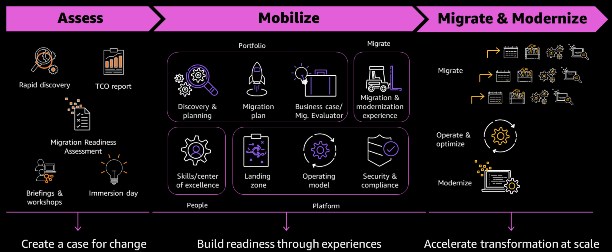

# Cloud Adoption and Landing Zones

## Introduction

A Landing Zone (LZ) forms the foundation of your cloud platform and centrally provides networking, account vending, security, logging and guardrail capabilities for all accounts within your organisation. Without an LZ deployed, there will be an administrative overhead for your cloud and technology teams as they will likely need to configure the settings and access in each individual account which is created.

AWS, Microsoft Azure and Google Cloud each have their own design for an LZ on their platforms, but importantly they all have the deployment of this capability as part of their Cloud Adoption Framework (CAF).

## Cloud Adoption Framework (CAF)

Jump to: [Microsoft Azure](./README.md#microsoft-azure) [Google Cloud](./README.md#google-cloud)

### Amazon Web Services

> The AWS Cloud Adoption Framework (AWS CAF) leverages AWS experience and best practices to help you digitally transform and accelerate your business outcomes through innovative use of AWS. AWS CAF identifies specific organisational capabilities that underpin successful cloud transformations. These capabilities provide best practice guidance that helps you improve your cloud readiness.
> 
> AWS CAF groups its capabilities in six perspectives: Business, People, Governance, Platform, Security, and Operations. Each perspective comprises a set of capabilities that functionally related stakeholders own or manage in the cloud transformation journey. Use the AWS CAF to identify and prioritise transformation opportunities, evaluate and improve your cloud readiness, and iteratively evolve your transformation roadmap.

The AWS CAF provides a clear roadmap for cloud adoption within your organisation and places a heavy focus on the need to adapt your culture to take full advantage of the cloud. The need to adapt processes and invest in training cannot be understated to ensure that you build the right teams from external hires or internal up-skilling who are set up for success. They need to technically deliver your migration and operational capability, but also promote ways of working and help teams who may have only worked with on-premises servers for the last 15 or more years. Cloud Adoption should not simply be about hiring a load of new team members who lack the historical context of the organisation as this will introduce an 'us and them' culture. Instead this needs to be a fine balance between adapting existing roles, hiring new talent and leveraging partner support for acceleration and tiger-teaming.

To get a better understanding of your cloud readiness, you can take this intuative assessment which will score your answers against a cloud adoption baseline then provide recommendations on areas for focus and improvement: https://cloudreadiness.amazonaws.com/#/cart

The AWS Cloud Migration Journey has three different phases:

* **Assess** - The first phase of a cloud migration begins with a cloud readiness assessment of your enterprise’s current state. These assessment tasks give you a clear picture of what you will migrate, as well as a business case for migration and total cost of ownership (TCO) analysis for migration.
* **Mobilise** - With a strong understanding of your current state and your portfolio along with the solid business case, you develop in the assessment phase, you can demonstrate the value of the cloud to your organisation.
* **Migrate and Modernise** - The migrate phase uses the patterns, processes, tools, resources, and methodology defined and tested during the mobilise phase to migrate applications at scale. After using the best practices and lessons learned from the earlier phases, you can implement a migration factory, a blueprint of scaling implementation and operations, through automation and agile delivery.

### Microsoft Azure

### Google Cloud

## Further Reading

#### [Reaching Cloud Velocity: A Leader's Guide to Success in the AWS Cloud](https://amzn.to/3QqW36D)

Reaching Cloud Velocity provides leadership best practices covering the most requested customer topics. Whilst there is a heavy focus on services which are provided on the AWS Cloud, there are cloud agnostic approaches that are shared in this book which can be applied to any cloud platform.

* How enterprises are transforming with AWS
* Aligning business and technology strategy to benefit from cloud
* Re-skilling and scaling your cloud fluency
* Setting the right culture and organization model to attract and retain engineering talent
* How to migrate data centres to AWS while holistically benefitting from the improved availability, security, and governance it can offer.

The book also goes deeper into how leaders can leverage the inherent reliability and durability of the AWS Cloud, and how compute, containers, serverless, APIs, microservices, database, analytics, and machine learning have evolved into a set of highly resilient, secure, and scalable building blocks - allowing builders to innovate at a fraction of the costs they would have typically come to expect.

#### [AWS Cloud Adoption Framework](https://aws.amazon.com/cloud-adoption-framework/)
Access the latest copy of the AWS CAF here and download the full eBook copy to understand each element of a cloud adoption journey.
