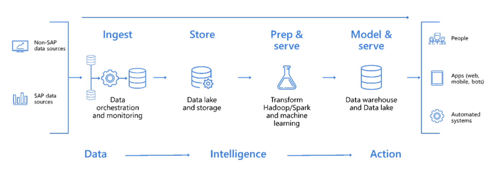

# Compute Services

## Introduction

Compute services on the cloud are often the first place that many organisations look for hosting requirements. This is likely because of the typical use of a datacentre for hosting servers and virtual machines in a private cloud. All three public cloud providers which are covered in this resource have a robust offering of standard and niche compute services to meet almost all of customer needs. As with many cloud services, it's important to recognise that these offerings are always growing, especially with some providers now offering bespoke chipsets to beat the performance, cost and sustainability capabilities of traditional Intel and AMD chipsets.

## AWS Services

**Follow the AWS Services link at the bottom of this section for the latest list of services**

|Service|Description|Azure Service|Google Cloud Service|
|---|---|---|---|
|Amazon EC2|Virtual servers in the cloud|[Azure Virtual Machine](./compute.md#Azure-Services)|[Google Compute Engine](./compute.md#Google-Cloud-Services)|
|Amazon EC2 Auto Scaling|Scale compute capacity to meet demand|[Azure Autoscale](./compute.md#Azure-Services)|[Google Auto Scaler](./compute.md#Google-Cloud-Services)|
|Amazon Lightsail|Launch and manage virtual private servers|[Azure App Service Environment](./compute.md#Azure-Services)|-|
|AWS App Runner|Production web applications at scale made easy for developers|[Azure Container Apps](./compute.md#Azure-Services)|[Google Cloud Run](./compute.md#Google-Cloud-Services)|
|AWS Auto Scaling|Scale multiple resources to meet demand|-|-|
|AWS Batch|Run batch jobs at any scale|[Azure Batch](./compute.md#Azure-Services)|[Google Preemptible VMs](./compute.md#Google-Cloud-Services)|
|AWS Compute Optimizer|Identify optimal AWS Compute resources|[Azure Advisor](./compute.md#Azure-Services)|[Google Cloud Platform Security](./compute.md#Google-Cloud-Services)|
|AWS Elastic Beanstalk|Run and manage web apps|[Azure Web Apps](./compute.md#Azure-Services) [Azure Cloud Services](./compute.md#Azure-Services)|[Google App Engine](./compute.md#Google-Cloud-Services)|
|AWS Lambda|Run code without thinking about servers|[Azure Functions](./compute.md#Azure-Services)|[Google Cloud Functions](./compute.md#Google-Cloud-Services)|
|AWS Lambda SnapStart|Achieve up to 10x faster Java function startup times|-|-|
|AWS Local Zones|Run latency sensitive applications closer to end users|-|-|
|AWS Nitro Enclaves|Create additional isolation to further protect highly sensitive data within EC2 instances|[Azure Dedicated Host](./compute.md#Azure-Services)|[Sole Tenant Node](./compute.md#Google-Cloud-Services)|
|AWS Outposts|Run AWS infrastructure on-premises|[Azure Stack](./compute.md#Azure-Services)|[Google Anthos](./compute.md#Google-Cloud-Services)|
|AWS Parallel Cluster|An open source cluster management tool that makes it easy for you to deploy and manage High Performance Computing (HPC) clusters on AWS|[Azure CycleCloud](./README.md#Azure-Services)|-|
|AWS Serverless Application Repository|Discover, deploy, and publish serverless applications|-|-|
|AWS SimSpace Weaver|Build dynamic, large-scale spatial simulations on AWS managed infrastructure|-|-|
|AWS Wavelength|Deliver ultra-low latency applications for 5G devices|[Azure Edge Zones](./compute.md#Azure-Services)|-|
|VMware Cloud on AWS|Build a hybrid cloud without custom hardware|[Azure VMWare Solution](./compute.md#Azure-Services)|[Google Cloud VMware Engine](./compute.md#Google-Cloud-Services)|
|Amazon EC2 Image Builder|Build and maintain secure images|[Azure VM Image Builder](./compute.md#Azure-Services)|[Google Cloud Build](./compute.md#Google-Cloud-Services)|

### Highlight Points

#### Instance Types

AWS has a large number of compute services which are designed to meet the many needs of customers far beyond simply providing a means of running virtual machines. Within the EC2 portfolio, there are also a wide range of specific instance types which are custom built by AWS to provide capabilities such as low-cost high-performance ARM processing with the Graviton3 chipset, M1 Mac chipsets for developers writing MacOS applications and deep learning instances which are intended for machine learning requirements.

Below is a non-exhaustive list of specialist instance types available on EC2:

|Instance Type|Capability|
|---|---|
|Amazon EC2 C7g Instances & Graviton3|Best price performance for compute-intensive workloads in Amazon EC2|
|Amazon EC2 C7gn Instances|Graviton compute optimized instances with up to 200 Gbps of networking bandwidth|
|Amazon EC2 G5g Instances|Best price performance in Amazon EC2 for Android game streaming|
|Amazon EC2 Hpc6id Instances|Amazon EC2 Hpc6id instances deliver cost-effective price performance for data-intensive HPC workloads|
|Amazon EC2 Hpc7g Instances|Deliver up to 60% better performance over comparable previous generation instances for compute-intensive workloads|
|Amazon EC2 I4i Instances|The highest local storage performance in Amazon EC2|
|Amazon EC2 Im4gn/Is4gen Instances|Best price performance and lowest cost SSD-based storage in Amazon EC2|
|Amazon EC2 Inf2 Instances|High performance at the lowest cost in Amazon EC2 for the most demanding inference workloads|
|Amazon EC2 M1 Mac Instances|Better application build performance and faster tests for macOS|
|Amazon EC2 M6a Instances|General purpose instances powered by 3rd generation AMD EPYC processors|
|Amazon EC2 Spot Instances|Run workloads for up to 90% off|
|Amazon EC2 Trn1 Instances|The best price performance for training deep learning models in the cloud|
|Amazon EC2 X2idn/X2iedn Instances|Up to 50% better compute price performance than previous generation instances|
|Amazon EC2 X2iezn Instances|The fastest Intel Xeon Scalable processor in the cloud|

AWS Graviton is a family of AWS-developed processors designed to deliver the best price performance for your cloud workloads running in Amazon EC2. You can find out more about the current range of Graviton chipsets on the AWS product page here: https://aws.amazon.com/ec2/graviton.

Why would you choose Graviton over an Intel or AMD chipset? If your application is capable of running ARM-based workloads, then you will gain access to higher performance, lower cost and importantly lower energy usage. For customers who are looking to build sustainability into their cloud principles, Graviton is a fantastic example of where financial and carbon savings can be realised. 

Many marketplace vendors including the likes of SAP are now fully supporting ARM-based chipsets to allow customers to leverage the benefits of Graviton processors.

["SAP HANA Cloud Now Supports AWS Graviton" (07 November 2023)](https://press.aboutamazon.com/aws/2023/11/sap-hana-cloud-now-supports-aws-graviton)

#### AWS Lambda

AWS Lambda is a serverless, event-driven compute service that lets you run code for virtually any type of application or backend service without provisioning or managing servers. The service lends itseld really well to event-driven architecture where you run your code based on a 'trigger' such as a HTTP API call or Eventbridge event. Event-driven architecture has the advantage of generally being cheaper to run than EC2 instances running 24x7 because you're only being charged for the time (down to the millisecond) that the execution is taking place.

Take an example such as a photo upload application:

AWS Lambda natively supports Java, Go, PowerShell, Node.js, C#, Python, and Ruby code, and provides a Runtime API which allows you to use any additional programming languages to author your functions.

It's important to note that AWS Lambda is stateless, so it doesn't keep a track of what has happened before and after. You can build your function to take inputs and provide outputs from tasks which execute either side of your function, but it is completely ephemeral. If you have a need to handle state then you'll need to look at AWS Step Functions which is a state machine service capable of running complex process flows. Find out more here: https://aws.amazon.com/step-functions.

#### Low Latency and High Sensitivity

Should you have a requirement for running appplications which are highly sensitive to latency or you have compliance reasons why hosting on the Public Cloud isn't possible, then AWS Outposts might be an option to consider. AWS Outposts is a family of fully managed solutions delivering AWS infrastructure and services to virtually any on-premises or edge location for a truly consistent hybrid experience. Outposts solutions allow you to extend and run native AWS services on premises, and is available in a variety of form factors, from 1U and 2U Outposts servers to 42U Outposts racks, and multiple rack deployments.

With AWS Outposts, you can run some AWS services locally and connect to a broad range of services available in the local AWS Region. Run applications and workloads on premises using familiar AWS services, tools, and APIs. Outposts supports workloads and devices requiring low latency access to on-premises systems, local data processing, data residency, and application migration with local system interdependencies. 

AWS Outposts is quite an investment for the luxury of having AWS services hosted in your local environment, so please consider whether there are any other services which may meet your requirements. [AWS Wavelength](https://aws.amazon.com/wavelength/) and [AWS Local Zones](https://aws.amazon.com/about-aws/global-infrastructure/localzones/), for example, are designed to bring the cloud as close to the edge as possible for low latency requirements. Equally, make sure you read more about all the [compliance frameworks](https://aws.amazon.com/artifact) which AWS is certified for to ensure that your compliance needs cannot be met. For US-hosted applications, there is also the opportunity of running your applications on [GovCloud](https://aws.amazon.com/govcloud-us) which are purpose-built regions aimed for hosting highly sensitive data for government customers.

Find out more about all the AWS Compute services which are available [here](https://aws.amazon.com/products/?aws-products-all.sort-by=item.additionalFields.productNameLowercase&aws-products-all.sort-order=asc&awsf.re%3AInvent=*all&awsf.Free%20Tier%20Type=*all&awsf.tech-category=tech-category%23compute&awsm.page-aws-products-all=1).

## Azure Services

**Follow the Azure Services link at the bottom of this section for the latest list of services**

|Service|Description|AWS Service|Google Cloud Service|
|---|---|---|---|
|App Service|Quickly create powerful cloud apps for web and mobile|[AWS Lambda, AWS Fargate, AWS App Runner](./compute.md#AWS-Services)|[App Engine](./compute.md#Google-Cloud-Services)|
|Azure Batch|Cloud-scale job scheduling and compute management|[AWS Batch](./compute.md#AWS-Services)|[Dataproc](./compute.md#Google-Cloud-Services)|
|Azure Functions|Process events with serverless code|[AWS Lambda](./compute.md#AWS-Services)|[Cloud Functions](./compute.md#Google-Cloud-Services)|
|Azure Quantum|Experience quantum impact today on Azure|[Amazon Bracket](./compute.md#AWS-Services)|-|
|Azure Red Hat OpenShift|Fully managed OpenShift service, jointly operated with Red Hat|[Red Hat OpenShift Service on AWS](./compute.md#AWS-Services)|-|
|Azure Spring Apps|A fully managed Spring Cloud service, built and operated with Pivotal|[Spring Cloud for AWS](./compute.md#AWS-Services)|-|
|Azure VMware Solution|Run your VMware workloads natively on Azure|[VMWare Cloud on AWS](./compute.md#AWS-Services)|[VMWare Engine](./compute.md#Google-Cloud-Services)|
|Cloud Services|Create highly-available, infinitely-scalable cloud applications and APIs|[AWS Elastic Beanstalk](./compute.md#AWS-Services)|[Google App Engine](./compute.md#Google-Cloud-Services)|
|Container Apps|Build and deploy modern apps and microservices using serverless containers|[AWS App Runner](./compute.md#AWS-Services)|[Google Cloud Run](./compute.md#Google-Cloud-Services)|
|Container Instances|Easily run containers on Azure without managing servers|[Amazon ECS, Amazon EKS, Bottlerocket](./compute.md#AWS-Services)|[Kubernetes Engine](./compute.md#Google-Cloud-Services)|
|Container Registry|Store and manage container images across all types of Azure deployments|[Amazon ECR](./compute.md#AWS-Services)|[Artifact Registry](./compute.md#Google-Cloud-Services)|
|CycleCloud|Create, manage, operate, and optimize HPC and big compute clusters of any scale|[Parallel Cluster](./compute.md#AWS-Services)|-|
|Dedicated Host|A dedicated physical server to host your Azure VMs for Windows and Linux|[Amazon EC2 Dedicated Host, AWS Nitro Enclaves](./compute.md#AWS-Services)|[Sole Tenant Node](./compute.md#Google-Cloud-Services)|
|Kubernetes Service|Simplify the deployment, management, and operations of Kubernetes|[Amazon AKS](./compute.md#AWS-Services)|[Kubernetes Engine](./compute.md#Google-Cloud-Services)|
|Service Fabric|Develop microservices and orchestrate containers on Windows or Linux|[AWS Lambda](./compute.md#AWS-Services)|[Google Cloud Functions, EventArc](./compute.md#Google-Cloud-Services)|
|Virtual Desktop|Deliver a virtual desktop experience to any device at cloud scale|[Amazon Workspaces](./compute.md#AWS-Services)|-|
|Virtual Machines|Provision Windows and Linux virtual machines in seconds|[Amazon EC2](./compute.md#AWS-Services)|[Compute Engine](./compute.md#Google-Cloud-Services)|
|VM Scale Sets|Manage and scale up to thousands of Linux and Windows virtual machines|[Amazon EC2 Auto Scaling](./compute.md#AWS-Services)|[Compute Engine Autoscaler](./compute.md#Google-Cloud-Services)|

### Highlight Points

#### SAP HANA

SAP HANA is a high performance multi-modal database platform that operates at lightning speed by processing transactions in memory. This lets companies process massive amounts of data with near-zero latency, query data in an instant, and become truly data-driven. With the move to cloud from a traditional on-premises architecture pattern, SAP is now bringing AI to the platform reinforcing their position as a world leader for enterprise resource planning (ERP).

Why is this important to highlight? Azure, like other hyperscalers have specific E Series instance types which are optimised for heavy in-memory applications such as SAP HANA. This allows customers to deploy their strategic applications on the same cloud as their SAP HANA platform to allow integration within the same cloud organisation.

With Azure, organizations can integrate their SAP and non-SAP data through an extensive portfolio of Azure data services and create real-time dashboard views of the current operations using SAP and Microsoft business intelligence tools including Microsoft Power Automate, Power Apps and Power BI.

#### Deep Learning and Rendering

For simulation, deep learning, graphics rendering, video editing, gaming and remote visualisation workloads, Azure has their N Series GPU-enabled virtual machines equipped with NVIDIA Tesla-series GPUs allowing users to move their traditional on-premises workflows into the cloud. This provides resillience and the ability to scale up or scale out their processing and reduce the time it would have taken to process rendering and computation on self-managed hardware. This capability extends across their desktop-as-a-service (DaaS) and server-based workloads.

Huge shout out to [Alexy Polkovnikov](https://www.linkedin.com/in/alexeypolkovnikov/) for his Azure Services resource which breaks down the latest list and a clear description for each service. Check it out [here](https://azurecharts.com/overview).

Access the latest official list of Azure compute services [here](https://azure.microsoft.com/en-gb/products#compute).

## Google Cloud Services

**Follow the Google Cloud Services link at the bottom of this section for the latest list of services**

|Service|Description|AWS Service|Azure Service|
|---|---|---|---|
|Cloud GPUs|Train and run machine learning models faster than before.|[Amazon Elastic Compute Cloud (EC2) P3](./compute.md#AWS-Services)|[GPU Optimized VMs](./compute.md#Azure-Services)|
|Cloud TPU|Train and run machine learning models faster than ever before.|[AWS UltraClusters](./compute.md#AWS-Services)|[Azure Virtual Machine](./compute.md#Azure-Services)|
|Compute Engine|Accelerate your digital transformation with high-performance VMs.|[Amazon Elastic Compute Cloud (EC2)](./compute.md#AWS-Services)|[Azure Virtual Machines](./compute.md#Azure-Services)|
|Compute Engine Autoscaler|Automatically add or delete VM instances from a managed instance group (MIG) based on increases or decreases in load.|[AWS EC2 Autoscaling](./compute.md#AWS-Services)|[Azure Autoscale, Virtual Machine Scale Sets](./compute.md#Azure-Services)|
|OS Login|Manage SSH access to your instances using IAM without having to create and manage individual SSH keys.|[Amazon EC2 Instance Connect](./compute.md#AWS-Services)|-|	
|Persistent Disk|Reliable, high-performance block storage for VM instances.|[Amazon Elastic Block Store (EBS)](./compute.md#AWS-Services)|[Azure Managed Disks](./compute.md#Azure-Services)|
|SSH from the browser|Connect to a Compute Engine virtual machine (VM) instance using SSH with the Google Cloud console in your web browser.|[AWS EC2 Instance Connect](./compute.md#AWS-Services)|[Azure Bastion](./compute.md#Azure-Services)|
|VM Manager|Manage operating systems for large virtual machine (VM) fleets running Windows and Linux on Compute Engine.|[AWS Systems Manager](./compute.md#AWS-Services)|-|
|Sole-tenant nodes|Host your VMs on hardware dedicated only to your project.|[Amazon EC2 Dedicated Host](./compute.md#AWS-Services)|[Azure Dedicated Host](./compute.md#Azure-Services)|
|SAP on Google Cloud|Run SAP on Google Cloud.|[SAP on AWS](./compute.md#AWS-Services)|[SAP on Azure](./compute.md#Azure-Services)|
|App Engine|Build highly scalable applications on a fully managed serverless platform.|[AWS Lambda, AWS Fargate, AWS App Runner](./compute.md#AWS-Services)|[Azure App Service](./compute.md#Azure-Services)|
|VMware Engine|Migrate and run your VMware workloads on Google Cloud.|[VMware Cloud on AWS](./compute.md#AWS-Services)|[Azure VMware Solution](./compute.md#Azure-Services)|

### Highlight Points

Find out more about the latest Google Cloud services comparison between AWS and Azure here: https://cloud.google.com/docs/get-started/aws-azure-gcp-service-comparison

Access the latest official list of Google Cloud compute services [here](https://cloud.google.com/products#section-5).
