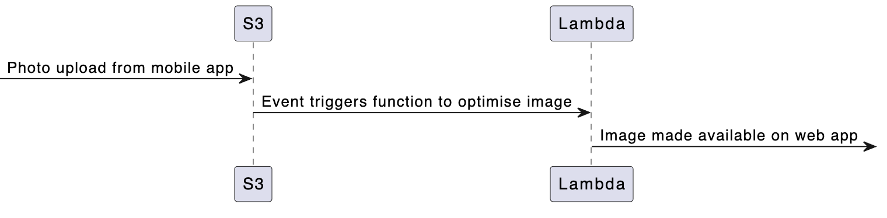

# Compute Services

## Introduction

## AWS Services

|Service|Description|Azure Service|Google Cloud Service|
|---|---|---|---|
|Amazon EC2|Virtual servers in the cloud|[Azure Virtual Machine](./compute.md#Azure-Services)|[Google Compute Engine](./compute.md#Google-Cloud-Services)|
|Amazon EC2 Auto Scaling|Scale compute capacity to meet demand|[Azure Autoscale](./compute.md#Azure-Services)|[Google Auto Scaler](./compute.md#Google-Cloud-Services)|
|Amazon Lightsail|Launch and manage virtual private servers|[Azure App Service Environment](./compute.md#Azure-Services)|-|
|AWS App Runner|Production web applications at scale made easy for developers|[Azure Container Apps](./compute.md#Azure-Services)|[Google Cloud Run](./compute.md#Google-Cloud-Services)
|AWS Auto Scaling|Scale multiple resources to meet demand|-|-|
|AWS Batch|Run batch jobs at any scale|[Azure Batch](./compute.md#Azure-Services)|[Google Preemptible VMs](./compute.md#Google-Cloud-Services)
|AWS Compute Optimizer|Identify optimal AWS Compute resources|[Azure Advisor](./compute.md#Azure-Services)|[Google Cloud Platform Security](./compute.md#Google-Cloud-Services)
|AWS Elastic Beanstalk|Run and manage web apps|[Azure Web Apps](./compute.md#Azure-Services) [Azure Cloud Services](./compute.md#Azure-Services)|[Google App Engine](./compute.md#Google-Cloud-Services)
|AWS Lambda|Run code without thinking about servers|[Azure Functions](./compute.md#Azure-Services)|[Google Cloud Functions](./compute.md#Google-Cloud-Services)
|AWS Lambda SnapStart|Achieve up to 10x faster Java function startup times|-|-|
|AWS Local Zones|Run latency sensitive applications closer to end users|-|-|
|AWS Outposts|Run AWS infrastructure on-premises|[Azure Stack](./compute.md#Azure-Services)|[Google Anthos](./compute.md#Google-Cloud-Services)
|AWS Serverless Application Repository|Discover, deploy, and publish serverless applications|-|-|
|AWS SimSpace Weaver|Build dynamic, large-scale spatial simulations on AWS managed infrastructure|-|-|
|AWS Wavelength|Deliver ultra-low latency applications for 5G devices|[Azure Edge Zones](./compute.md#Azure-Services)|-|
|VMware Cloud on AWS|Build a hybrid cloud without custom hardware|[Azure VMWare Solution](./compute.md#Azure-Services)|[Google Cloud VMware Engine](./compute.md#Google-Cloud-Services)
|Amazon EC2 Image Builder|Build and maintain secure images|[Azure VM Image Builder](./compute.md#Azure-Services)|[Google Cloud Build](./compute.md#Google-Cloud-Services)

### Highlight Points

#### Instance Types

AWS has a large number of compute services which are designed to meet the many needs of customers far beyond simply providing a means of running virtual machines. Within the EC2 portfolio, there are also a wide range of specific instance types which are custom built by AWS to provide capabilities such as low-cost high-performance ARM processing with the Graviton3 chipset, M1 Mac chipsets for developers writing MacOS applications and deep learning instances which are intended for machine learning requirements.

Below is a non-exhaustive list of instance types available on EC2:

|Instance Type|Capability|
|---|---|
|Amazon EC2 C7g Instances & Graviton3|Best price performance for compute-intensive workloads in Amazon EC2|
|Amazon EC2 C7gn Instances|Graviton compute optimized instances with up to 200 Gbps of networking bandwidth|
|Amazon EC2 G5g Instances|Best price performance in Amazon EC2 for Android game streaming|
|Amazon EC2 Hpc6id Instances|Amazon EC2 Hpc6id instances deliver cost-effective price performance for data-intensive HPC workloads|
|Amazon EC2 Hpc7g Instances|Deliver up to 60% better performance over comparable previous generation instances for compute-intensive workloads|
|Amazon EC2 I4i Instances|The highest local storage performance in Amazon EC2|
|Amazon EC2 Im4gn/Is4gen Instances|Best price performance and lowest cost SSD-based storage in Amazon EC2|
|Amazon EC2 Inf2 Instances|High performance at the lowest cost in Amazon EC2 for the most demanding inference workloads|
|Amazon EC2 M1 Mac Instances|Better application build performance and faster tests for macOS|
|Amazon EC2 M6a Instances|General purpose instances powered by 3rd generation AMD EPYC processors|
|Amazon EC2 Spot Instances|Run workloads for up to 90% off|
|Amazon EC2 Trn1 Instances|The best price performance for training deep learning models in the cloud|
|Amazon EC2 X2idn/X2iedn Instances|Up to 50% better compute price performance than previous generation instances|
|Amazon EC2 X2iezn Instances|The fastest Intel Xeon Scalable processor in the cloud|

AWS Graviton is a family of AWS-developed processors designed to deliver the best price performance for your cloud workloads running in Amazon EC2. You can find out more about the current range of Graviton chipsets on the AWS product page here: https://aws.amazon.com/ec2/graviton.

Why would you choose Graviton over an Intel or AMD chipset? If your application is capable of running ARM-based workloads, then you will gain access to higher performance, lower cost and importantly lower energy usage. For customers who are looking to build sustainability into their cloud principles, Graviton is a fantastic example of where financial and carbon savings can be realised. 

Many marketplace vendors including the likes of SAP are now fully supporting ARM-based chipsets to allow customers to leverage the benefits of Graviton processors.

["SAP HANA Cloud Now Supports AWS Graviton" (07 November 2023)](https://press.aboutamazon.com/aws/2023/11/sap-hana-cloud-now-supports-aws-graviton)

#### AWS Lambda

AWS Lambda is a serverless, event-driven compute service that lets you run code for virtually any type of application or backend service without provisioning or managing servers. The service lends itseld really well to event-driven architecture where you run your code based on a 'trigger' such as a HTTP API call or Eventbridge event. Event-driven architecture has the advantage of generally being cheaper to run than EC2 instances running 24x7 because you're only being charged for the time (down to the millisecond) that the execution is taking place.

Take an example such as a photo upload application:

AWS Lambda natively supports Java, Go, PowerShell, Node.js, C#, Python, and Ruby code, and provides a Runtime API which allows you to use any additional programming languages to author your functions.

It's important to note that AWS Lambda is stateless, so it doesn't keep a track of what has happened before and after. You can build your function to take inputs and provide outputs from tasks which execute either side of your function, but it is completely ephemeral. If you have a need to handle state then you'll need to look at AWS Step Functions which is a state machine service capable of running complex process flows. Find out more here: https://aws.amazon.com/step-functions.

#### Low Latency and High Sensitivity

Should you have a requirement for running appplications which are highly sensitive to latency or you have compliance reasons why hosting on the Public Cloud isn't possible, then AWS Outposts might be an option to consider. AWS Outposts is a family of fully managed solutions delivering AWS infrastructure and services to virtually any on-premises or edge location for a truly consistent hybrid experience. Outposts solutions allow you to extend and run native AWS services on premises, and is available in a variety of form factors, from 1U and 2U Outposts servers to 42U Outposts racks, and multiple rack deployments.

With AWS Outposts, you can run some AWS services locally and connect to a broad range of services available in the local AWS Region. Run applications and workloads on premises using familiar AWS services, tools, and APIs. Outposts supports workloads and devices requiring low latency access to on-premises systems, local data processing, data residency, and application migration with local system interdependencies. 

AWS Outposts is quite an investment for the luxury of having AWS services hosted in your local environment, so please consider whether there are any other services which may meet your requirements. [AWS Wavelength](https://aws.amazon.com/wavelength/) and [AWS Local Zones](https://aws.amazon.com/about-aws/global-infrastructure/localzones/), for example, are designed to bring the cloud as close to the edge as possible for low latency requirements. Equally, make sure you read more about all the [compliance frameworks](https://aws.amazon.com/artifact) which AWS is certified for to ensure that your compliance needs cannot be met. For US-hosted applications, there is also the opportunity of running your applications on [GovCloud](https://aws.amazon.com/govcloud-us) which are purpose-built regions aimed for hosting highly sensitive data for government customers.

Find out more about all the AWS Compute services which are available [here](https://aws.amazon.com/products/?aws-products-all.sort-by=item.additionalFields.productNameLowercase&aws-products-all.sort-order=asc&awsf.re%3AInvent=*all&awsf.Free%20Tier%20Type=*all&awsf.tech-category=tech-category%23compute&awsm.page-aws-products-all=1).

## Azure Services

## Google Cloud Services
