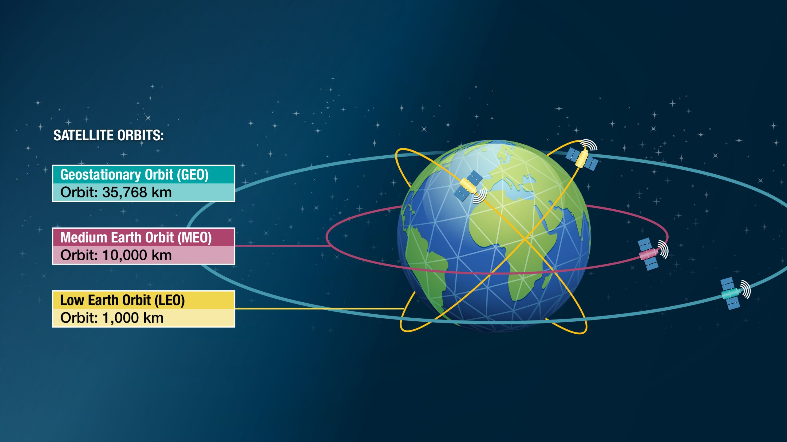
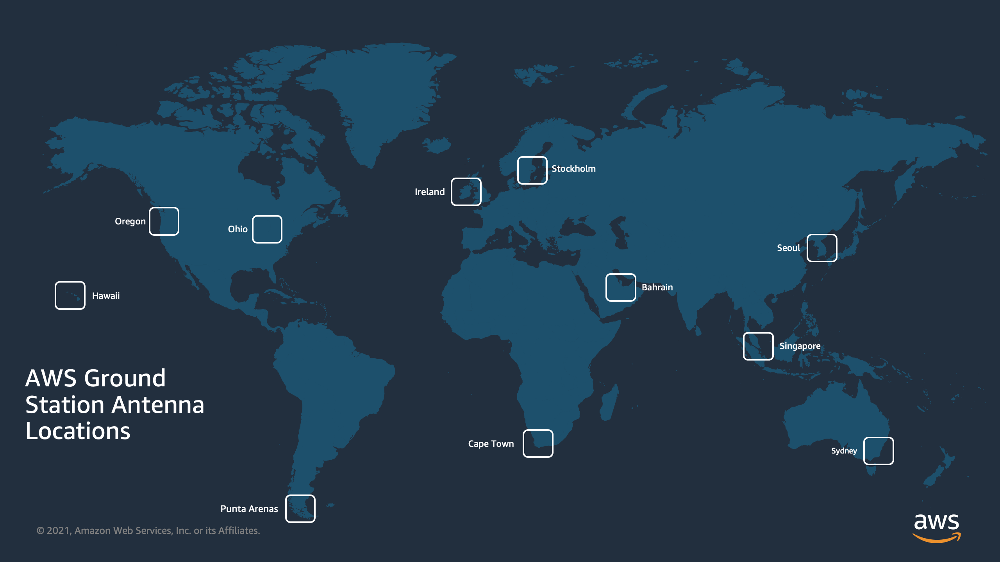
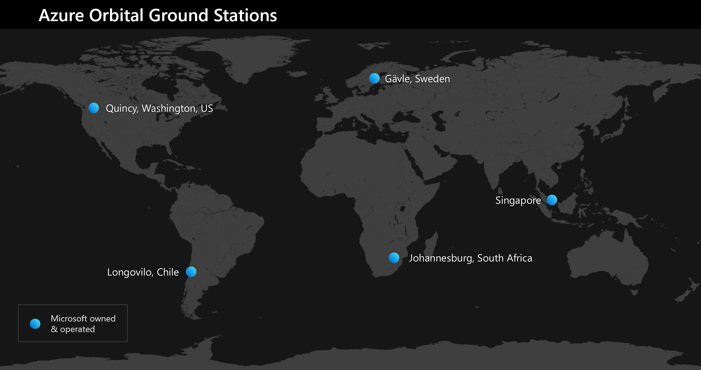

# Satellite Services

## Introduction

Reliable and high-speed global communications have been the critical backbone of the public cloud since its inception, and with the development of new services, offerings and requirements each month this remains the highest of priorities. This is all well and good for modern, connected metropolitan cities, but what about harder to reach areas?

*Source: https://www.satellitetoday.com/content-collection/2046/*

Launching new constellations into low-Earth orbit (LEO) and medium-Earth orbit (MEO) has been grabbing the headlines for many years now with the likes of SpaceX and Project Kuiper (Amazon) establishing a significant number of satellites into orbit to address the next chapter of communication focussed on providing connectivity from anywhere. For organisations looking to launch their own satellites into orbit for many purposes, there has traditionally been the need to engage in expensive commercial contracts for accessing downlink communications backbones for retrieving information from satellites as they pass over ground stations. In addition, there have been onward challenges of ingesting this information into private or public cloud environments for analysis.

## AWS Ground Station

[AWS Ground Station](https://aws.amazon.com/ground-station) was the first service offering a 'satellite as a service' model for organisations needing to control satellites and ingest data directly into their AWS VPC without the need to be tied to heavy commercial contracts. With AWS Ground Station, you have direct access to AWS services and the AWS Global Infrastructure including a low-latency global fiber network. For example, you can use Amazon S3 to store the downloaded data, Amazon Kinesis Data Streams for managing data ingestion from satellites, and Amazon SageMaker for building custom machine learning applications that apply to your data sets.

This service can provide customers with a saving of up to 80% compared to traditonal operational costs, and you only pay for the 'antenna time' that is used without any long-term commitments.

At time of writing, there are currently 11 AWS Ground Station locations around the world which provide global coverage which serve most AWS regions which gets the data to the analysts and developers as quick as possible. You can begin processing your satellite data within seconds of reception at the antenna system. This enables you to turn raw data into processed information or analysed knowledge within a matter of seconds. Today, Synthetic Aperture Radar (SAR) operators are leveraging this capability to develop intelligence for first responders to use during active search, rescue, and recovery operations.

[Pricing](https://aws.amazon.com/ground-station/pricing/) follows the standard AWS approach with on-demand and reserved pricing:

|Contact Type|Pricing|
|---|---|
|Narrowband Reserved|$3 per minute|
|Wideband Reserved|$10 per minute|
|Narrowband On-Demand|$10 per minute|
|Wideband On-Demand|$22 per minute|

## Azure Orbit Earth Station and Azure Space

In October 2020, Microsoft announced a partnership with SpaceX Starlink which provides customers with provide high-speed, low-latency satellite broadband for the new Azure Modular Datacenter (MDC) which provides datacentre capabilities in rugged and remote locations. Further to this, Microsoft also launched the first of their [Azure Orbit Ground Stations](https://learn.microsoft.com/en-us/azure/orbital/) which provides high-speed and low-latency connectivity between satellites and the Azure Cloud.

Microsoft currently operates 5 owned and operated ground station [locations](https://learn.microsoft.com/en-us/azure/orbital/about-ground-stations) with partner ground stations also available.

Microsoft added the latest preview service into their Azure Space portfolio in September 2023, [Planetary Computer](https://planetarycomputer.microsoft.com/). Planetary Computer is a robust geospatial data platform. It combines a multi-petabyte catalog of global multi-source data with intuitive APIs, a flexible scientific environment that allows users to answer global questions about that data, and applications that put those answers in the hands of many stakeholders. It is used by researchers, scientists, students, and organizations across the globe with millions of API calls every month.

[Pricing](https://azure.microsoft.com/en-gb/pricing/details/orbital) for Azure Orbital Earth Station contact time is available on-demand and reserved: 

|Contact Type|Pricing|
|---|---|
|On-Demand|$3 per minute|
|Reserved|$10 per minute|